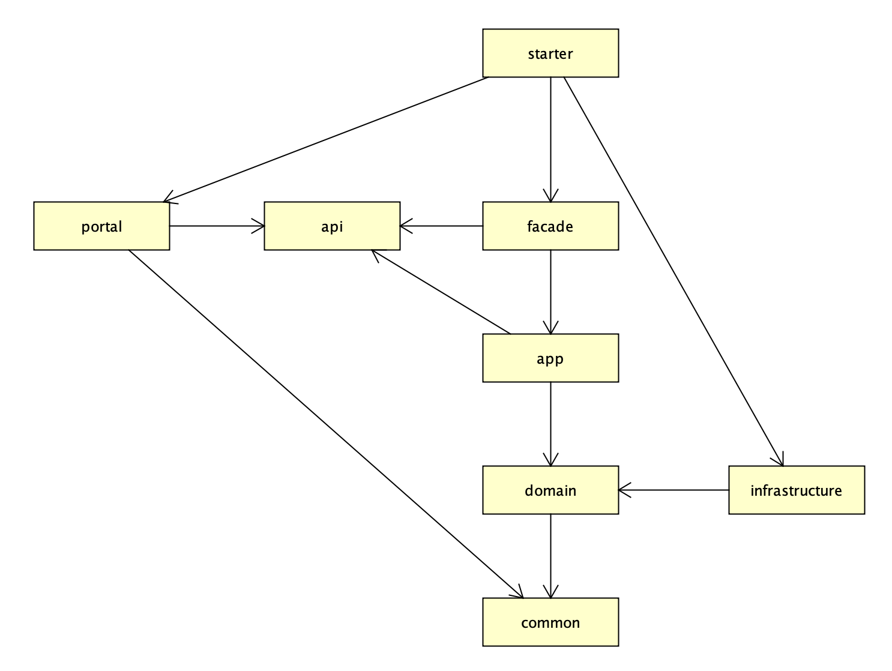

# 2. 功能列表

```$xslt
用户端
    文章分类
        筛选文章
    标签
        查看详情
        筛选文章/问答
    文章
        写文章
        编辑
        删除
        评论
        点赞
        查看详情
    问答
        提问题
        编辑
        删除
        查看详情
        评论
        关注
        设置评论为最佳答案
        筛选已解决问题
        筛选未解决问题
    用户
        登录
        查看详情
        编辑个人资料
        更新登录密码
        关注好友
        查看粉丝
    关注
        关注的用户文章/问答
        关注的问答
        评论的问答
        点赞的文章
        评论的文章
    搜索
        根据文章/问答标题/内容模糊搜索
        
```


# 3. 各模块功能

- starter模块：项目启动入口模块，SpringBootApplication启动类就在这个模块，这个模块也会把一些通过依赖倒置实现的功能infrastructure模块依赖进项目中；
- portal模块：系统门户模块，用户和管理员需要访问的页面都在这里，系统提供的http接口也都在这里；
- api模块：系统提供的所有对外接口，参考dubbo项目的api模块设计，如果企业用户系统之间调用使用dubbo的话，可以将api模块打包提供出去，就是对外提供的接口服务了；
- facade模块：对api模块接口的实现，以及对接口请求参数的合法性校验，不做任何业务逻辑处理，将校验合法的请求转发给app模块进行业务处理；
- app模块：业务用例处理模块，这里将领域服务domain模块和外部服务infrastructure模块做了聚合，用于实现业务用例、还做了一些领域事件监听等业务处理；
- domain模块：核心领域实体、领域仓储、领域服务等都在这里定义；
- infrastructure模块：基础设置及三方依赖模块，数据库、邮件发送、文件上传、搜索等三方服务的实现都在这里；
- common模块：公共枚举的定义、工具类、自定义业务异常等都在这里；
## 3.1 用户
1. 登录
+ (1)forumportal/src/main/resources/templates/include/navbar.html路径下点击登录 弹出id为loginModal的登录表单
+ (2)在 forum-api的model定义了一个ResultModel包含状态码、msg和泛型数据等定义
+ (3)【api】在api的request里面定义了登录或注册的请求参数，例如登录需要email和password，同时标记@Data生成getter setter方法
+ (4）【facade】在facade模块impl包下对api模块接口实现，请求参数合法性校验,合法性校验是validator包下的UserValidator里面的静态方法，所以可以使用类名.方法名直接调用。而具体检查参数使用的是forum-common 模块support包下的工具类CheckUtil，检查请求路径参数是否为空
+ (5)【facade】 在登录接口的实现类中使用facade模块自己的工具类ResultModelUtil来返回一个包装好的，符合ResultModel格式的结果。默认检查没有问题的话，只需要设置结果泛型data,调用底层返回ResultModel里面的泛型数据是String类型的token
+ ❓️ api怎么获取到的表单提交的数据
+ (6)【app】 data的获取需要继续调用service层在forum-app模块中，首先进入UserManager，通过在api模块定义的UserEmailLoginRequest获取到传入的，并且经过facade模块检查非空的邮箱。Service层不仅仅是app模块还有domain模块定义了getByEmail接口通过email获取一个用户对象，而这个接口是在infrastructure模块实现的，而这里调用了持久层DAO，并调用infrastructure的工具类将DAO层查询到的结果转换为user类型
+ ❓️ 为什么查询为UserDO再转为User类型  只使用一个会怎么样
+ (7)【infrastructure】dao层也在infrastructure模块，UserDao使用了Mybatis。在xml中首先定义了resultMap，然后写sql语句，但是他这个sql语句是拆分了公共部分放在sql标签内，通过唯一的refid来引用。查询的结果封装为UserDO再转为User类型
+ (8) Service层获取到user对象后继续检查密码是否一样，使用common模块的工具类比较md5加密之后的密码，更新user对象的最后登录时间，最后调用DAO层的update跟新user数据库，最后调用AbstractLoginManagerd的login方法
+ (9)在这个login方法中使用了一个方法UUID.randomUUID().toString().replaceAll("-", "")来生成String类型token，清除之前的缓存，重新保存缓存（🤦‍♂️具体实现比较复杂还没看）,然后触发操作日志 最后返回token。
+ (10)portal系统门户(post请求➕@RequestBody将表单数据提交到api定义的UserRegisterRequest形参里面)->api接口->facade接口实现->app(service层)->domain定义获取数据库对象的接口->infrastructure实现上一个接口->dao使用mybatis查询
+ (11)数据流：因为登录服务只是验证。service验证完之后 token存入缓存并返回->ResultModel\<String>封装token的结果集合->portal模块在response请求中加入了一个sid就是token数据然后有返回了这个resultModel->js回调函数装入token
```js
 post('/user-rest/login', {
           'email': email,
                'password': md5(password)
            }, function (data) {
                localStorage.setItem('token', data);
                location.reload();
            });
```
2. 查看详情

4. 编辑个人资料
5. 更新登录密码
6. 关注好友
7. 查看粉丝

# 4. 特性

##  前端

- 多终端适配（手机端，pc端）
- 自定义主题颜色，方便企业用户自定义主题
- 编辑器支持control + s保存
- 编辑器支持control + v复制图片上传

##  后端

- 日志带有调用链，方便排查问题
- 分布式session，支持集群部署
- 用户角色权限分级，便于用户管理
- 接口权限校验，接口操作更安全

## 可扩展功能接口

- 文章/问答更新时自带审核，可接入审核中心便于运营管理
- 文件存储抽象接口，可支持自定义接入企业内部文件储存服务
- 缓存服务抽象接口，可支持自定义接入企业内部缓存服务
- 搜索服务抽象接口，可支持自定义接入企业内部搜索服务

# 5. 技术栈

## 后端

- 数据库：mysql
- 持久层框架：mybatis
- 数据库连接池管理：hikaricp
- 数据库分页插件：github pagehelper
- mvc框架：spring mvc
- 应用层容器：spring boot
- json序列化工具：fastjson
- 邮件发送sdk：javax mail
- 七牛云存储sdk：qiniu java sdk
- 服务端页面渲染：thymeleaf

## 前端

- 前端markdown编辑器：mavon-editor
- 管理后台js框架：vue
- 用户端UI框架：bootstrap
- 管理后台UI框架 iview

# 6. 部分页面展示

## 用户页面展示

- 首页


- 问答页


- 关注页


- 消息列表页


- 文章详情页


- 标签详情页


- 搜索页


- 用户主页


- 写文章页


# 6 管理后台页面


# 7 安装

请参考 [forum-java安装指南](https://www.developers.pub/article/1005736)。
